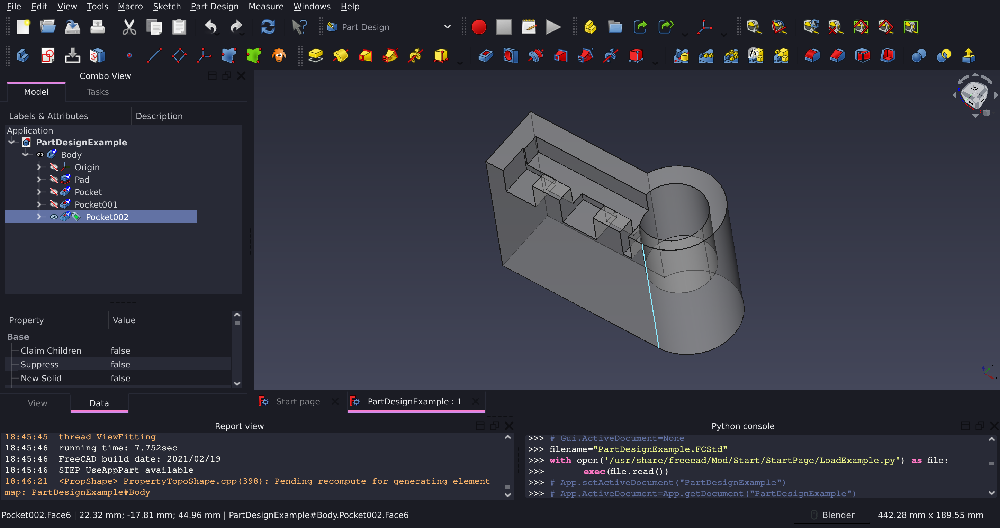

# Dracula for [FreeCAD](https://www.freecadweb.org)

> A dark theme for [FreeCAD](https://www.freecadweb.org).

## Install

All instructions can be found at [draculatheme.com/freecad](https://draculatheme.com/freecad).

## Team

This theme is maintained by the following person(s) and a bunch of [awesome contributors](https://github.com/dracula/freecad/graphs/contributors).

|  |     |   |
| ------------------------------------------------------------------------------------------------ | ------------------------------------------------------------------------------------------------ | -------------------------------------------------------------------------------------------------------- |
| [Eleanor Clifford](https://github.com/eleanor-clifford)                                                  | [Chrismettal](https://gitlab.com/chrismettal)                                                    | [Brandon Beaumia](https://github.com/brandonbeaumia)

## Community

- [Twitter](https://twitter.com/draculatheme) - Best for getting updates about themes and new stuff.
- [GitHub](https://github.com/dracula/dracula-theme/discussions) - Best for asking questions and discussing issues.
- [Discord](https://draculatheme.com/discord-invite) - Best for hanging out with the community.

## License

[MIT License](./LICENSE)
